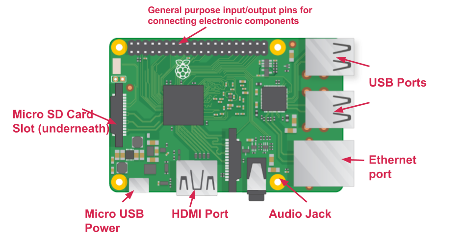
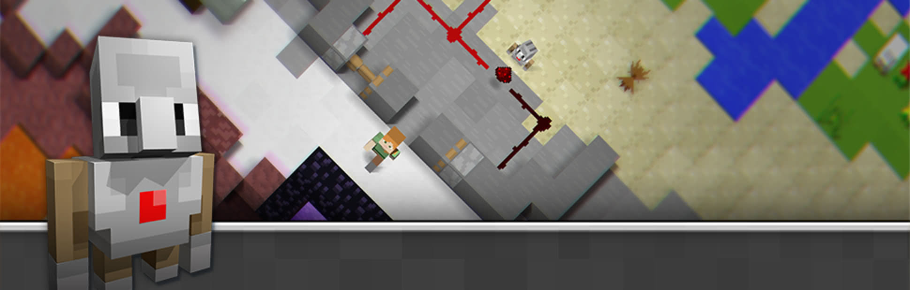

## Welcome to the Computing Camp at Waterford Institute of Technology!

This is a HEA funded camp aimed at senior cycle 2nd-level students, to introduce them to computer science and programming concepts.

## Day One

### Morning Session 10am - 12pm.

In the first session, we’ll look at the components that make up “a computer” (hardware and software). The students will assemble a Raspberry Pi computer, install and operating system and get some introductory experience with Raspbian, a Linux distribution built specifically for the Pi.

Once their machine is up and running and the students are comfortable with the environment, we’ll move onto some basic web development, using HTML, CSS and JavaScript.

#### Activities
- [Getting Started With the Raspberry Pi](https://projects.raspberrypi.org/en/projects/raspberry-pi-getting-started/5){:target=“_blank”}
- [Basic HTML with Trinket](https://projects.raspberrypi.org/en/projects/happy-birthday){:target=“_blank”}
- [Make a Cat Meme with JavaScript](https://projects.raspberrypi.org/en/projects/cat-meme-generator){:target=“_blank”}

### Afternoon Session 1pm - 3pm. 

This session will be chiefly concerned with programming, using the widely popular game Minecraft as a backdrop for the activities.

Students will first complete a Minecraft-themed Hour of Code. The [Hour of Code](https://hourofcode.com/ie){:target="_blank"} started as a one-hour introduction to computer science, designed to demystify "code", to show that anybody can learn the basics, and to broaden participation in the field of computer science. It has since become a worldwide effort to celebrate computer science. The "Player" uses programming blocks and JavaScript to complete a series of puzzles and progress to the next level until completion.

On completion of the Hour of Code the students will move Minecraft Pi, which is a special version of the game which comes preinstalled on Raspbian. We’ll use the Python language to “hack” into the game and have a bit of fun.

#### Activities
- [Hour of Code exercise](https://studio.code.org/s/hero/stage/1/puzzle/1){:target="_blank"}
- [Getting Started with Minecraft Pi](https://projects.raspberrypi.org/en/projects/getting-started-with-minecraft-pi){:target="_blank"}

### More Info
If you'd like more information about the computing courses available at WIT, we invite you to browse our [Department Website](https://www.wit.ie/schools/science/department_of_computing_maths){:target="_blank"}

